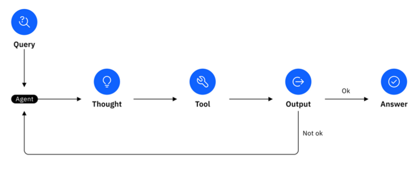
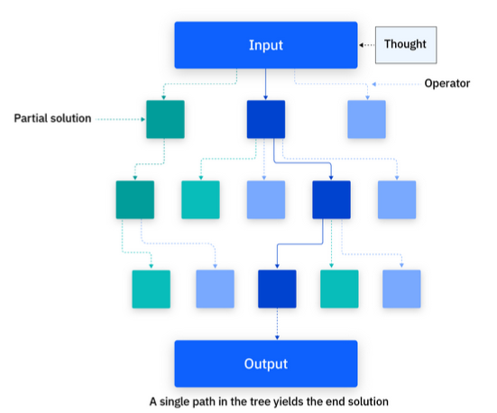
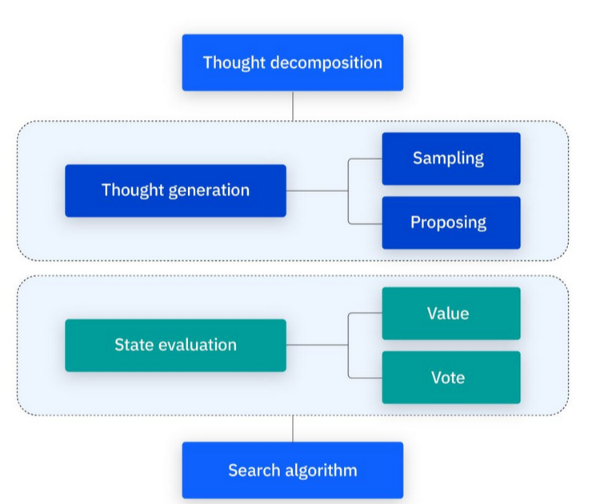
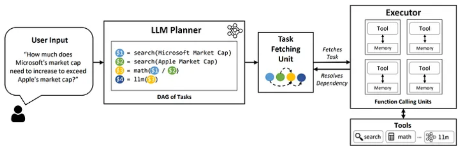

## In-Depth Notes

### Scratchpad / Working Memory

- Leverage when merging data across multiple data sources
- Only the name and description of each data chunk is provided to the LLM
  - To access a specific data chunk, the LLM looks at all names and description pairs and chooses the best option
  - **Example:** LangChain tools only provide the name and description to the LLM so it can quickly choose tools. Only then is the functionality provided.

---

### Chain of Thought (CoT)

- Prompt engineering technique that enhances LLM output
- Used for more complex tasks involving multi-step reasoning
- Guides model through step-by-step reasoning process
- Emergent ability
- Behavior is elicited through a single prompt
- **Idea is to make the LLM "think out loud"**

---

### ReAct

- Combines chain of thought and external tool use
- After taking an action, the model reevaluates its progress towards the goal and uses its observations to deliver the final answer or inform the next thought (_i.e., make another tool call_)
  - Observations can be from external knowledge sources (_i.e., a vectorstore_), its context memory (_i.e., previously answered questions_).
- Performance of ReAct-based agents depends on the model used (_i.e., more robust models handle more complex tasks_).
- Multi-agent ReAct frameworks: larger, more performant models as the central agent/brain, and smaller models to complete subtasks.
- Agent loop: action → observation → decision (repeat or end)
- **Important:** Determining the loop end condition
  - Add a maximum number of iterations to avoid endless loops
- ReAct prompting teaches the model:
  - It can loop until the task is complete
  - What external tools are available
  - To use chain-of-thought reasoning
  - To use scratchpad for reasoning
- Sequential and uses one LLM → **inefficiencies in latency, cost, accuracy**

---

### Tree-of-Thought (ToT)

- Each step branches into multiple paths
  - Agent can backtrack or explore alternate strategies
  - Multiple solutions are considered, discarding incorrect ones

**Four key components:**

1. **Thought decomposition**
   - Split problem into smaller steps ("thoughts")
   - Defines framework
2. **Thought generation**
   - **Sampling:** generate several independent thoughts (creative tasks)
   - **Proposing:** generate sequential thoughts (logical tasks)
3. **State evaluation**
   - Evaluate thoughts to ensure progress toward goal
   - **Value:** assign scalar value (e.g., rating 1–10)
   - **Vote:** compare solutions and select most promising (useful for subjective tasks)
4. **Search algorithm**
   - **BFS:** explores all solutions equally (good for shortest-path problems)
   - **DFS:** thorough exploration of each path

  

---

### CoT vs ToT

- **ToT:** better for RL scenarios requiring exploration
- **CoT:** better for problems requiring logical step-by-step reasoning

---

### Planner–Executor Split

**LLM Compiler Concept (based on traditional compilers):**

- **Planner:** Builds DAG of tools and execution order
- **Task Fetching Unit:** Schedules ready-to-run tasks
- **Executor:** Executes tools in parallel if possible

**Improvements over ReAct:**

- 3.7× faster
- 6.7× cheaper
- 9% more accurate on complex tasks

**ADaPT: As-Needed Decomposition and Planning with LLMs**

- Decomposes complex tasks into subtasks _only when necessary_
- **Components:**
  - Planner: short 3–5 step plans, triggered only if executor fails (larger LLM)
  - Controller: recursive algorithm, invokes planner at most _m_ times
  - Executor: attempts tasks (smaller LLM)

**Plan-and-Act**

- Same architecture as ADaPT
- **Planner:** Generates full plan (_what_ and _why_)
- **Executor:** Translates steps into actions (_does not_ self-assess)
- Replanning occurs after each step
- **Tradeoff:** Higher accuracy but more latency & token use

---

### 12-Factor Agents

1. Natural language → tool calls
2. **Own your prompts** (don’t outsource prompt engineering)
3. Own your context windows
   - Provide best possible inputs
   - Use YAML/XML instead of JSON to save tokens
4. **Tools are just structured output**
   - LLM outputs JSON → parse into object
5. Unify execution state & business state
6. Launch/pause/resume with simple APIs
7. Contact humans with tool calls
   - Output JSON with tags (e.g., `request_human_input`, `done_for_now`)
8. **Own your control flow** (summarization, caching, logging, rate-limiting, approval)
9. Compact errors into context window
   - Provide stacktrace
   - Use error counters
10. **Small, focused agents**
    - Cleaner context, easier debugging
11. Trigger from anywhere (Slack, Discord, SMS, etc.)
12. Make your agent a **stateless reducer**
    - Accumulator = context window
    - Reducer = LLM `DetermineNextStep + switch statement`

---

### AutoGPT

- Automates prompting process
- Creates agents to process tasks end-to-end

---

### Evaluation Heuristics

**Performance & Efficiency**

- Latency/response time: lower is better
- Throughput: more tasks per timeframe = better
- Token usage per request
- Cost per interaction
- Success rate (% tasks completed)

**Output Quality & Accuracy**

- Accuracy (alignment with correct outcome)
- Relevance (response fits user’s question/task)
- Coherence & fluency (natural, grammatical responses)
- Hallucination rate (fabricated info frequency)
- Groundedness (based on verifiable info)

**Robustness & Reliability**

- Consistency (same/similar answers to same questions)
- Error rate (mistake frequency)
- Adversarial resilience (resistance to malicious prompts)

**Safety & Ethics**

- Bias detection
- Harmful content generation

**User Experience**

- CSAT, NPS (direct user feedback)
- Turn count (messages needed to resolve request)

**Task-Specific**

- **LLM-as-a-Judge:** Evaluates text generation quality
- **BLEU:** Shared word sequences with reference
- **ROUGE:** Overlap of important n-grams with reference
